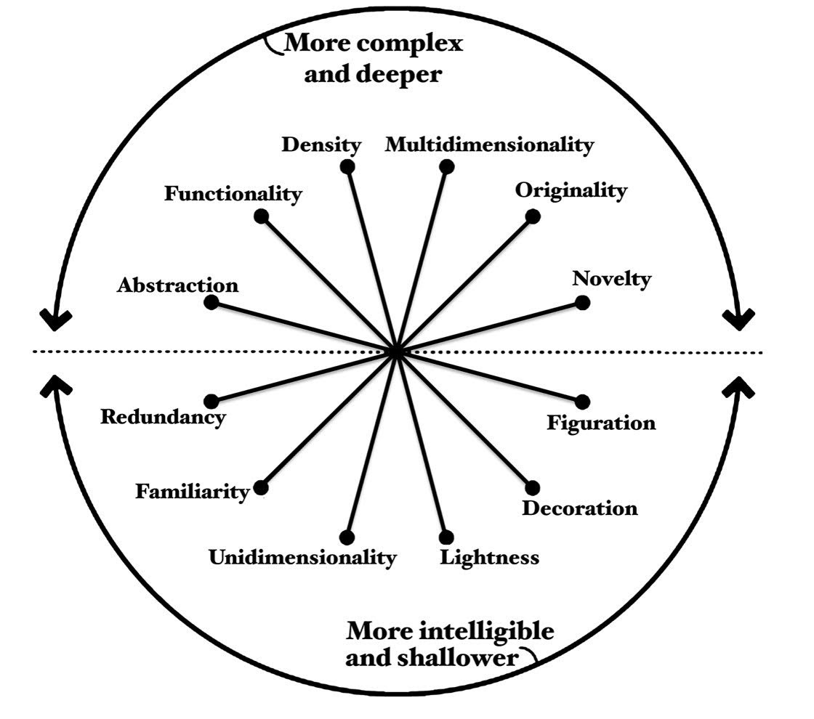

## Module 2 - Applied Plotting, Charting & Data Representation in Python

## Week 1 - Principles of Information Visualization

### Tools for Thinking about Design (Alberto Cairo)

### 1 - Visualization Wheel Dimensions

Conceptualization made by Alberto Cairo in **the functional art** book to describe design tradeoffs when building information graphics. In this conceptualization there are two poles of a circle.

The top one represents highly complex data which informs at a deep level. While the bottom provides easier access to data but only informs in a shallow manner. Inside the circle are dimensions which describe tradeoffs between two approaches.

* #### Abstraction - Figuration

    A highly figurative visual describes the phenomenon using physical representations of the phenomena, such as photographs or drawings. As the representations become less real and more conceptual, the emphasis shifts from figuration to abstraction;

    Boxes and charts (abstraction) or real-world physics objects (figuration);

* ####  Functionality - Decoration

    A completely functional graphic has no embellishments and is closer to a direct representation of the data. While a heavily decorated graphic has more artistic embellishments. As it is with all of these dimensions, there isn't a clear better or worse. Embellishments may increase the amount of time a viewer spends considering the visual. Exploring it's nuances and forming mental associations which may increase familiarity and memorability;

    No embellishments (functionality) or artistic embellishment (decoration);

* #### Density - Lightness

    they relate to the amount of information being shown. There are lots of great examples of this in scientific visuals, where some figures are intended to be studied in depth, while others are meant to quickly augment a narrative;

    Must be studied in depth (density) or understandable at glance (lightness);

* #### Multidimensional - Unidimensional 

    A multidimensional graphic describes a phenomena as a whole and invites the viewer to explore many different aspects of the phenomena. A unidimensional graphic instead focuses on a single or a few items and explores them in one or more way;

    Different aspects of phenomena (multidimensional) or single few items of phenomena (unidemensional);

* #### Originality - Familiarity

    Novel methods of visualization (originality) or established and well understood methods of visualization (familiarity);

* #### Novelty - Redundancy

    Redundancy is the tendency of a graphic to tell the same story in many different ways while novelty is the act of describing each phenomena in the graphic in only one way. This one's a bit tricky, you don't want to bore your readers or make your graphics overly complex. But you do want to encode information in a way which supports their understanding of the phenomena you've described;

    Explaining each item once (novelty) or encoding multiple explanations of the same phenomena (redundancy);

There are no rights and wrongs in the visualization wheel. The purpose of the wheel is to help you understand and compare the visual approaches you might take. As a reflective activity, Cairo suggested you can plot your thinking, a long each of these dimensions and then join those points together, to create a radar plot. Cairo suggests that the left wheel is more indicative of work being done by scientists and engineers, while the right wheel is more indicative of work being done by artists, graphic designers, and journalists. 

### 2 - Qualities of a Great Visualization

* #### Truthful 
    Be aware of your actions when cleaning, summarizing and manipulating data and ensure you aren't:

    * Misleading yourself (self deception);
    * Misleading your audience;
* #### Functionality
* #### Beauty
* #### Insightful
* #### Enlightening
    A combination of the previous four, but with a social ethical responsibility;

